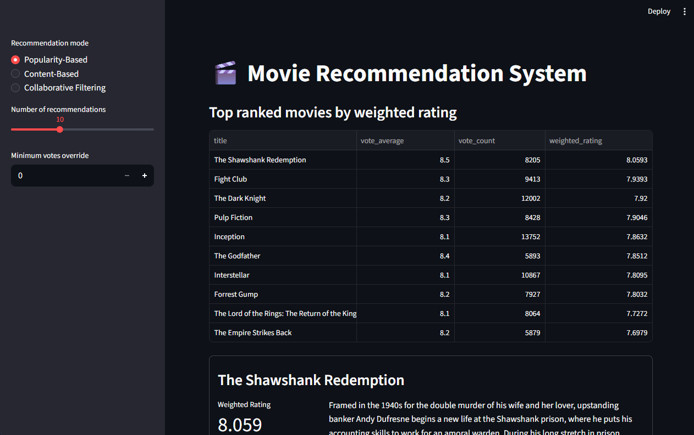
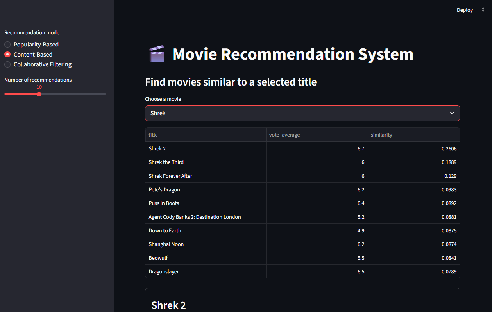
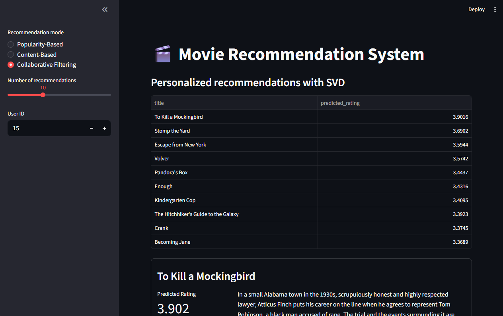

# 🎬 Movie Recommendation System

This is a project I made to test my knowledge after a python course
---

## Features

- Three recommendation strategies in one app
- Streamlit interface with mode selection in the sidebar
- Object-oriented code organization for easier maintenance

---

## Preview

### Popularity-Based mode



### Content-Based mode



### Collaborative Filtering mode



---

## Project Structure

```bash
movie_recommender_portfolio/
├── app/
│   └── main.py
├── assets/
│   └── screenshots/
├── data/
│   ├── credits.csv
│   ├── movies.csv
│   └── ratings.csv
├── notebooks/
│   ├── content_based_filtering.ipynb
│   ├── ML Collaborative Filtering.ipynb
│   └── movierec.ipynb
├── src/
│   ├── data/
│   │   └── data_loader.py
│   ├── models/
│   │   ├── collaborative_recommender.py
│   │   ├── content_recommender.py
│   │   └── popularity_recommender.py
│   └── services/
│       └── recommendation_service.py
├── .gitignore
├── README.md
└── requirements.txt
```

---

## Recommendation Modes

### 1. Popularity-Based Filtering
Ranks movies using a weighted rating formula that balances:
- average rating
- number of votes
- a minimum vote threshold

This is useful for general recommendations.

### 2. Content-Based Filtering
Uses TF-IDF on the overview column to measure text similarity between movie descriptions and recommend titles similar to a selected movie.
### 3. Collaborative Filtering
Uses SVD from the `surprise` library to estimate user preferences from historical ratings and generate personalized recommendations.

---

## Technologies Used

- Python **3.12** ⚠️
- Streamlit
- pandas
- scikit-learn
- scikit-surprise

---

## How to Run

### 1. Create and activate a virtual environment

```bash
python -m venv .venv
```

Windows:

```bash
.venv\Scripts\activate
```

Linux / macOS:

```bash
source .venv/bin/activate
```

### 2. Install the dependencies

```bash
pip install -r requirements.txt
```

### 3. Run the app

```bash
streamlit run app/main.py
```

---

## Notes

- The collaborative filtering mode depends on **scikit-surprise**.
- The original notebooks I used while studying were preserved in the `notebooks/` folder for reference and comparison.

---
